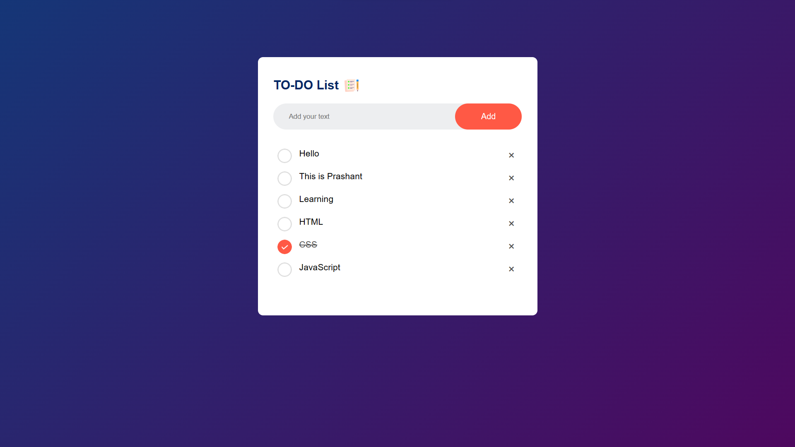

# To-Do List App

## Overview

The To-Do List App is a simple web application that allows users to manage their tasks. It provides a user-friendly interface for adding, marking as completed, and removing tasks from the list. Task data is persisted in the browser's localStorage, ensuring that your tasks are saved even if you close the app or refresh the page.

## Features

- **Add tasks**: Enter a task description in the input field and click "Add" to add it to the list.
- **Mark tasks as completed**: Click on a task to mark it as completed. Click it again to unmark it.
- **Remove tasks**: Click the "x" button next to a task to remove it from the list.
- **Data Persistence**: Your task list is saved in the browser's localStorage, so your tasks will remain even if you close or refresh the app.

## Demo

You can try the To-Do List App live by visiting the following link:

[Live Demo](https://your-demo-url.com)
